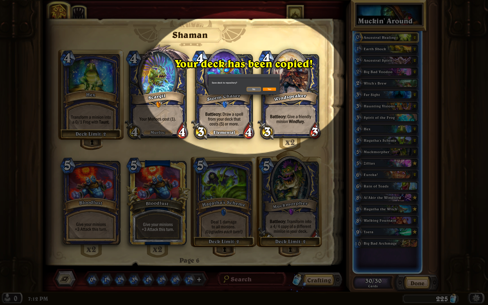

# Hearthstash
Store your Hearthstone decks in Git.

Currently with macOS support only, but I'm happy to integrate support
for other environments.

## Prerequisites
Hearthstash requires the following:
- macOS
- Node.js
- [clipboardy](https://github.com/sindresorhus/clipboardy)

## Screenshots

